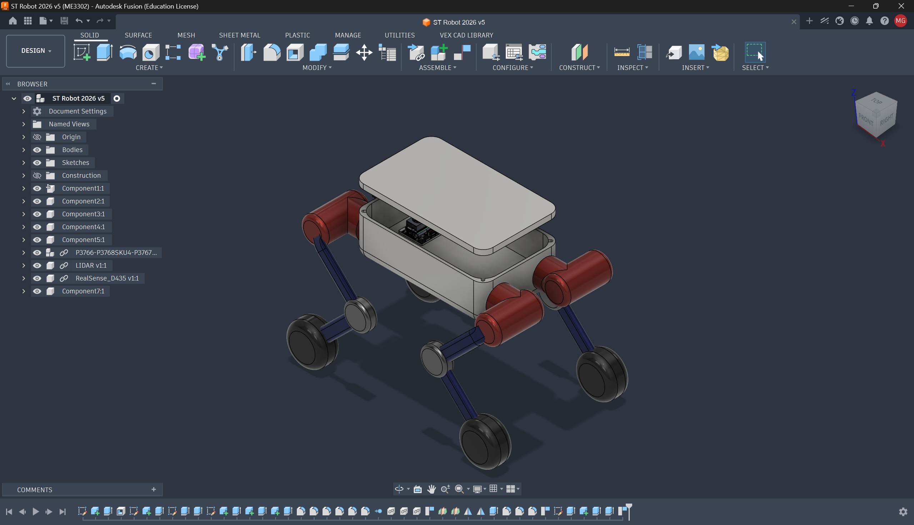
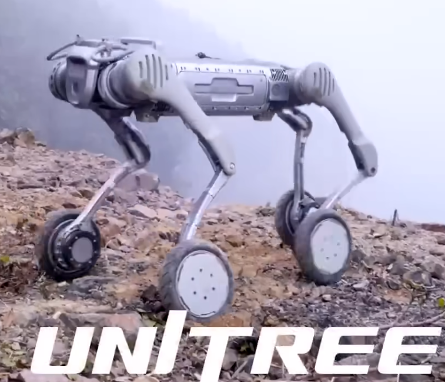
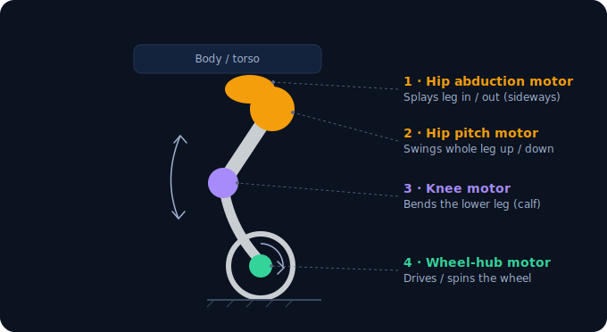
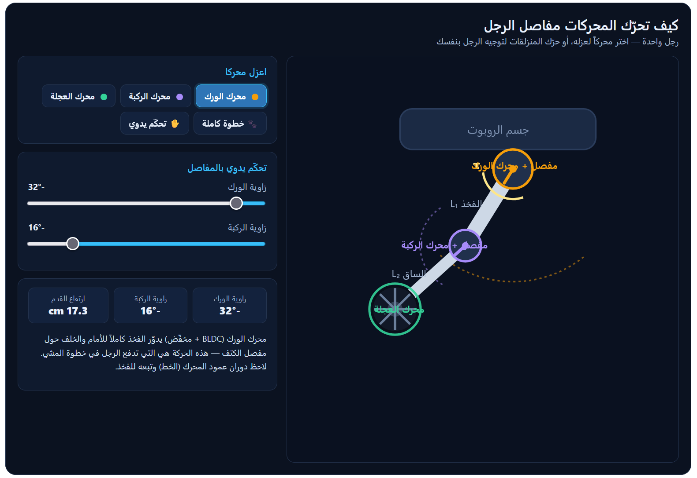
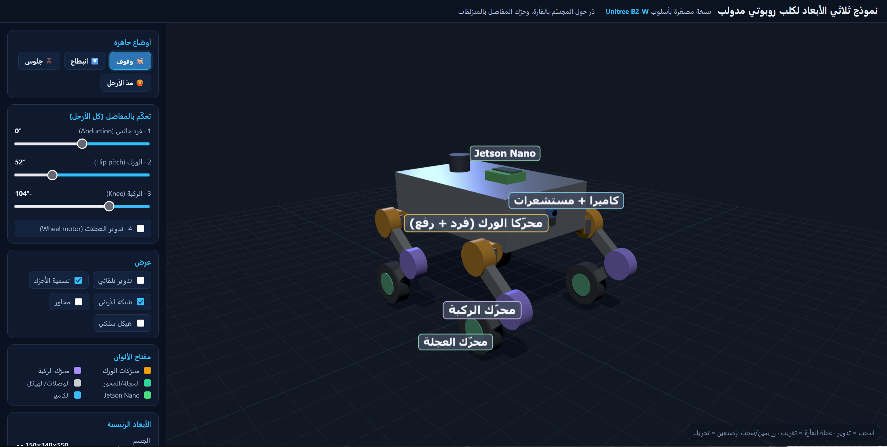
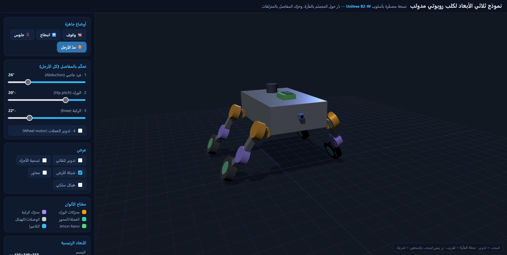
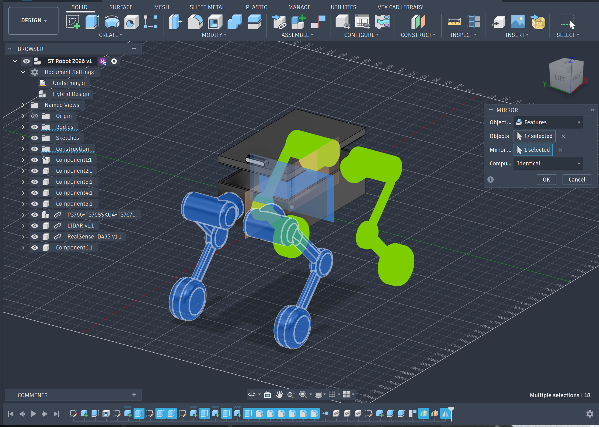

# ST Robot 2026 — DIY Wheel‑Legged Robot Dog

A student build of a **wheel‑legged quadruped** inspired by the **Unitree B2‑W**: four legs that both **walk** and **roll**, a 3D‑printed chassis, an NVIDIA **Jetson Orin** brain, and **16 motors** (three joints + one driven wheel per leg).

> 🌐 **Live tools** (once GitHub Pages is enabled): <https://sniper797.github.io/ST-2026-First-3D-Dog-Robot/>

---

## 1. Where it started — the Unitree B2‑W

I started by researching robot dogs and found the **Unitree B2‑W** — a quadruped with a **powered wheel** where each foot would normally be, so it can walk over rough terrain *and* roll fast on flat ground. That hybrid "wheel‑leg" idea is what this project recreates at roughly **half scale**.

> 🎥 **Reference video:** Unitree B2‑W — <https://www.youtube.com/watch?v=iI8UUu9g8iI>
> *(the photo above is a frame from this video — click it to watch)*

---

## 2. Understanding how it works

Each leg copies the Unitree topology: a **serial chain of 3 rotary joints** — hip **abduction** (roll) → hip **pitch** → **knee** — plus a **driven wheel** at the toe. That's **4 motors per leg × 4 legs = 16 motors** total (12 joint + 4 wheel).

To really understand the motion, I built interactive tools (with Claude):

| Tool | What it shows |
|---|---|
| [`حركة مفاصل الرجل ومحركاتها.html`](حركة%20مفاصل%20الرجل%20ومحركاتها.html) | One leg — isolate each motor (hip / knee / wheel) and drive the joints |
| [`حركة الروبوت B2-W.html`](حركة%20الروبوت%20B2-W.html) | The whole robot's movement modes (roll, walk, stand, climb) |
| [`robot-3d-model.html`](robot-3d-model.html) | Full interactive **3D model** — orbit it, move the joints, switch poses |

  
  

The 3D viewer lets you pose the robot (stand / crouch / sit / stretch) and see every motor in the project's color code — **hip = amber, knee = purple, wheel = green**:

---

## 3. Designing it in Fusion 360

I then modeled the robot **parametrically in Fusion 360** (units: mm, g): a central body box, four legs built once and **mirrored**, plus the electronics — **Jetson Orin**, an **Intel RealSense D435** camera and a **LiDAR**.

The chassis, legs and joints are all designed to be **3D‑printed**, which keeps the structure light (see the mass budget below). Every dimension is captured in [`spec.json`](spec.json) as the single source of truth.

---

## 4. Motors, mass & torque

Because the structure is **3D‑printed**, the mass is dominated by the **16 motors**, the Jetson and the battery — not the frame. That makes the whole robot far lighter than a metal build, so the joint torque is comfortable.

**Estimated mass**

| Part | ~Mass |
|---|---:|
| 3D‑printed structure (box + legs + brackets) | ~2–3 kg |
| Jetson Orin + RealSense + IMU + wiring | ~0.6 kg |
| Battery (6S LiPo) | ~1 kg |
| 16 motors (GO‑M8010‑6 class) | ~7 kg |
| **Total** | **≈ 10–11 kg** |

**Torque check — one hip joint (the loaded one)**

| Case | Load per leg | Foot reach | Required torque |
|---|---:|---:|---:|
| Standing (4 legs share) | ~2.5 kg | 0.10 m | **~2.2 N·m** |
| Trotting (2 legs, ×1.5 impact) | ~5 kg | 0.12 m | **~8 N·m** |

The **Unitree GO‑M8010‑6** used for hip‑pitch and knee is rated **9.5 N·m (23.7 N·m peak)** — comfortable, with headroom for hops. Since the robot is light, a smaller/cheaper QDD (e.g. **Damiao DM‑J4340** or **CubeMars AK70‑10**) would also work if you want to cut cost or weight.

### Bill of materials (core)

| Item | Spec | Qty |
|---|---|---:|
| Hip‑pitch & knee actuator | Unitree **GO‑M8010‑6** QDD, 9.5 / 23.7 N·m | 8 |
| Hip‑abduction actuator | Damiao **DM‑J4310‑2EC** QDD, 3 / 7 N·m | 4 |
| Wheel‑hub drive | CubeMars **AK60‑6** QDD | 4 |
| Compute | NVIDIA **Jetson Orin Nano** | 1 |
| Depth camera | Intel **RealSense D435** | 1 |
| LiDAR | 2D LiDAR (e.g. RPLIDAR A1) | 1 |
| IMU | BNO085 9‑DOF | 1 |
| Battery | 6S LiPo, ~22.2 V, ~8000 mAh | 1 |
| Structure | 3D‑printed (PLA / PETG / PA‑CF) | — |
| Wheels | Ø140 mm airless, hub‑mount | 4 |

Full parts list, kinematics and control‑stack notes are in [`spec.json`](spec.json).

---

## Repository contents

| File / folder | Description |
|---|---|
| [`robot-3d-model.html`](robot-3d-model.html) | Interactive 3D model viewer (Three.js) |
| [`حركة الروبوت B2-W.html`](حركة%20الروبوت%20B2-W.html) | Robot movement‑modes explainer |
| [`حركة مفاصل الرجل ومحركاتها.html`](حركة%20مفاصل%20الرجل%20ومحركاتها.html) | Leg‑joint / motor explainer || [`spec.json`](spec.json) | Authoritative parametric spec (dimensions, joints, BOM, review) |
| `ST Robot 2026.f3z` | Fusion 360 source archive (editable) |
| `ST Robot 2026.3mf` | 3D model export (color/assembly) |
| `ST Robot 2026.stl` | 3D‑printable mesh (STL) |
| `docs/` | Images used in this README |

> **Note:** the `.html` tools are interactive — open them in a browser (locally, or via GitHub Pages). `robot-3d-model.html` loads Three.js from a CDN, so it needs internet on first open.

---

## Key specs

| | |
|---|---|
| Body | 550 × 340 × 150 mm |
| Thigh / calf | 175 / 175 mm (1:1, like the B2) |
| Wheel | Ø140 mm |
| DOF | 3 joints × 4 legs + 4 wheels = **16 motors** |
| Scale | ~0.5× a Unitree B2 |
| Compute | Jetson Orin Nano + RealSense D435 + LiDAR + IMU |

---

## Credits & references

- **Reference robot & video:** Unitree B2‑W — <https://www.youtube.com/watch?v=iI8UUu9g8iI>
- Design exploration, interactive tools and documentation assisted by **Claude**.

*ST Robot 2026 — Students Project.*
